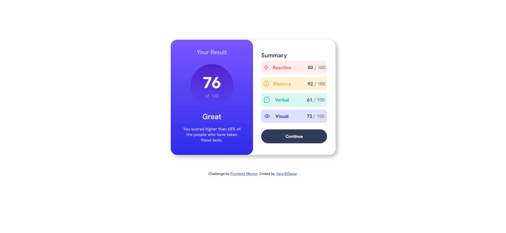
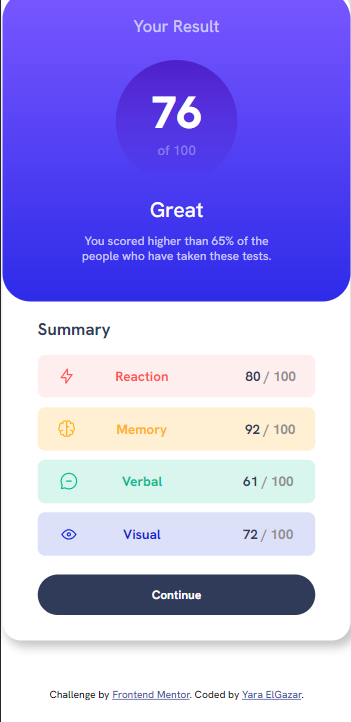

# Frontend Mentor - Results summary component solution

This is a solution to the [Results summary component challenge on Frontend Mentor](https://www.frontendmentor.io/challenges/results-summary-component-CE_K6s0maV). Frontend Mentor challenges help you improve your coding skills by building realistic projects.

## Overview

### Screenshot

### Links

- Solution URL: [Solution](https://github.com/yaraElGazar/frontend-mentor-challenge2-interactive-rating-component)
- Live Site URL: [Live site](https://yaraelgazar.github.io/frontend-mentor-challenge2-interactive-rating-component/)

### Built with

- Semantic HTML5 markup
- Flexbox
- Mobile-first workflow
